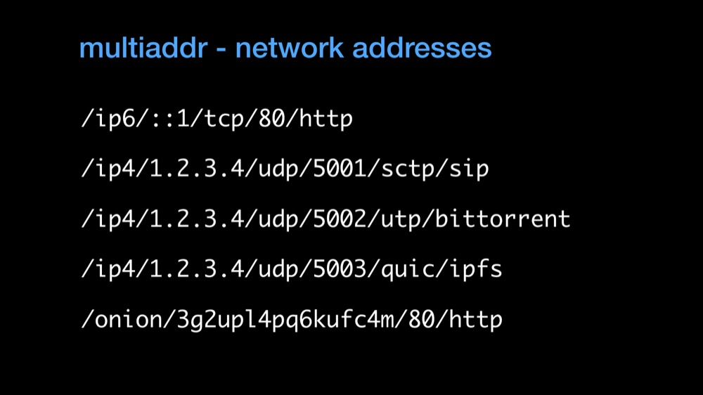

# multiformats

> "Never going to change" considered harmful.
> -- @lgierth

## Multiformats

This is the home repository for the multiformats effort, which produces these protocols:

- [multihash](//github.com/multiformats/multihash)
- [multiaddr](//github.com/multiformats/multiaddr)
- [multicodec](//github.com/multiformats/multicodec)
- [multistream](//github.com/multiformats/multistream)
- multibase (WIP)
- multigram (WIP)
- multikey (WIP)

## Stub Explanation

While we write out a proper readme, here's some quick explanation slides:

---

### Example: Multihash

#### Consider these 4 different hashes of same input

#### Same length: 256 bits

#### Different hash functions

#### Idea: self-describe the values to distinguish

#### Multihash: fn code + length prefix

#### Multihash: a pretty good multiformat

#### Multihash: has a bunch of implementations already

---

### Example: Multiaddr

Basic example of multiaddr

